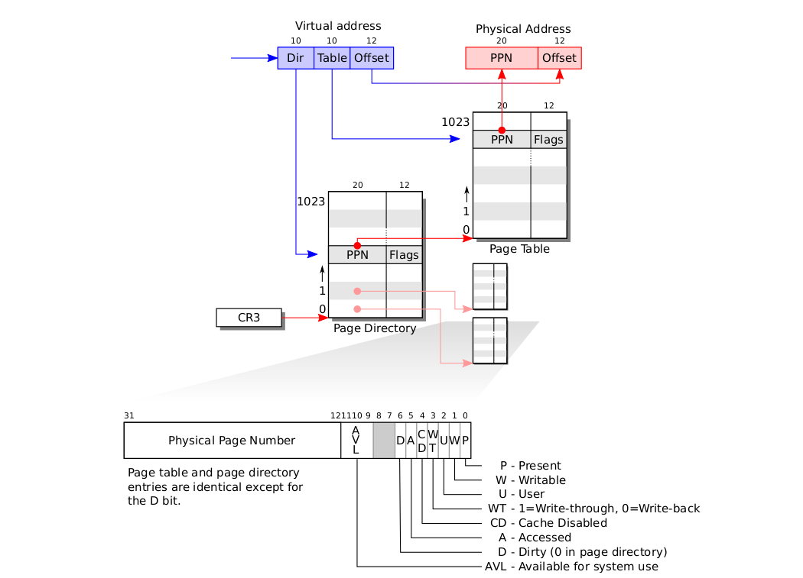
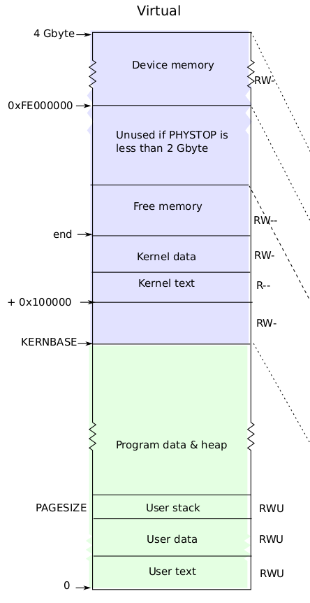
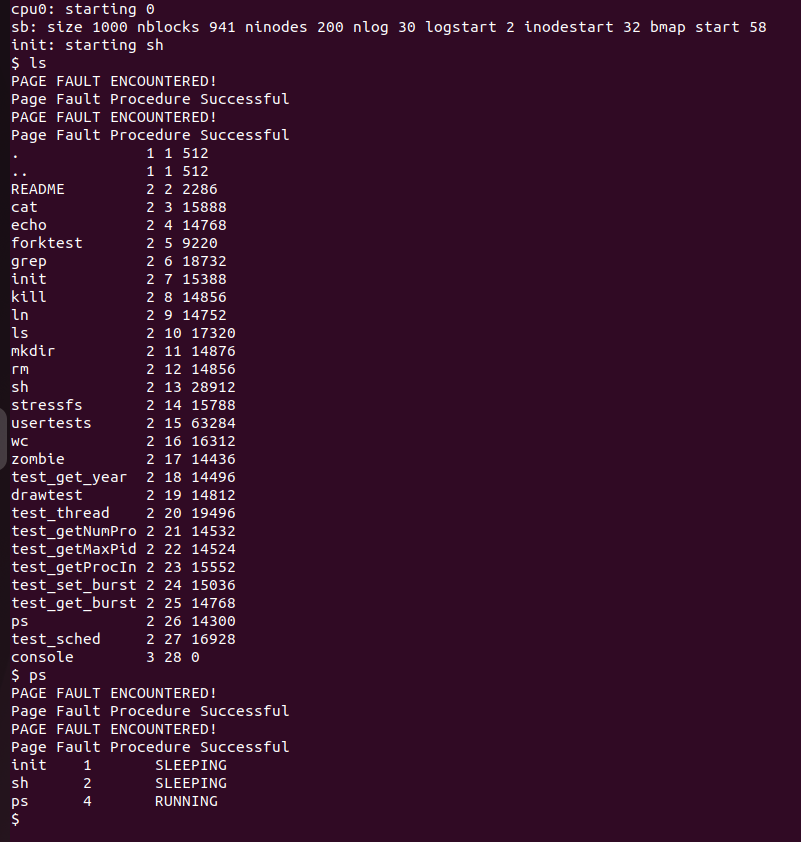
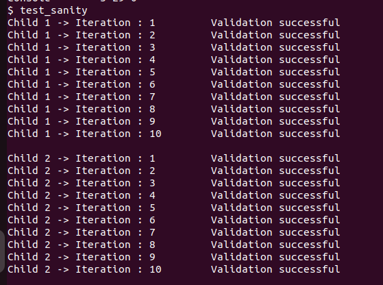

<h1 align="center">Memory Management</h1>

##  :beginner: Overview
* This section is an attempt to understanding **Memory Management** in **Xv6**.
* We will be implementing **lazy allocation** of heap memory, as most operating systems do, in **Xv6**.
* We will also implement the mechanism required for **swapping in** and **swapping out** of pages, an important feature lacking **Xv6**.
##  :round_pushpin: Basic Understanding of Memory Management in Xv6
* **Sbrk** is the system call for a process to shrink or grow its memory.
*  The **sbrk(n)** system call grows the process's memory size by **n** bytes, and then returns the start of the newly allocated region (i.e., the old size).
```C
int sys_sbrk(void)
{
  int addr;
  int n;

  if (argint(0, &n) < 0)
    return -1;
  addr = myproc()->sz;
  if (growproc(n) < 0)
    return -1;
  return addr;
}
```
* If n is postive, growproc(n) allocates one or more physical pages and maps them at the top of the process’s address space.
* If n is negative, growproc(n) unmaps one or more pages from the process’s address space and frees the corresponding physical pages.
```C
int
growproc(int n)
{
  uint sz;
  struct proc *curproc = myproc();

  sz = curproc->sz;
  if(n > 0){
    if((sz = allocuvm(curproc->pgdir, sz, sz + n)) == 0)
      return -1;
  } else if(n < 0){
    if((sz = deallocuvm(curproc->pgdir, sz, sz + n)) == 0)
      return -1;
  }
  curproc->sz = sz;
  switchuvm(curproc);
  return 0;
}
```
* The growproc() function in turn calls the allocuvm/deallocuvm functions which allocate/deallocate pages and updates the page table of the process.
* The kernel maintains a list of free pages with the help of **freelist**
```C
struct run {
  struct run *next;
};

struct {
  struct spinlock lock;
  int use_lock;
  struct run *freelist;
} kmem;
```
* **void kfree() function**.
```C
void
kfree(char *v)
{
  struct run *r;

  if((uint)v % PGSIZE || v < end || V2P(v) >= PHYSTOP)
    panic("kfree");

  // Fill with junk to catch dangling refs.
  memset(v, 1, PGSIZE);

  if(kmem.use_lock)
    acquire(&kmem.lock);
  r = (struct run*)v;
  r->next = kmem.freelist;
  kmem.freelist = r;
  if(kmem.use_lock)
    release(&kmem.lock);
}
```
* To free a page, we first check if it is after **kernel memory** ends and before the end of **physical memory**.
* We then just fill it with 1s and move the **kmem.freelist** to point to it and adjust other pointers accordingly.
* **void kalloc() function**.
```C
char*
kalloc(void)
{
  struct run *r;

  if(kmem.use_lock)
    acquire(&kmem.lock);
  r = kmem.freelist;
  if(r)
    kmem.freelist = r->next;
  if(kmem.use_lock)
    release(&kmem.lock);
  return (char*)r;
}
```
* Allocates one **4096-byte** page of physical memory.
* We just return the page pointed by **kmem.freelist** and move the pointer to the next element.
```C
int
allocuvm(pde_t *pgdir, uint oldsz, uint newsz)
{
  char *mem;
  uint a;

  if(newsz >= KERNBASE)
    return 0;
  if(newsz < oldsz)
    return oldsz;

  a = PGROUNDUP(oldsz);
  for(; a < newsz; a += PGSIZE){
    mem = kalloc();
    if(mem == 0){
      cprintf("allocuvm out of memory\n");
      deallocuvm(pgdir, newsz, oldsz);
      return 0;
    }
    memset(mem, 0, PGSIZE);
    if(mappages(pgdir, (char*)a, PGSIZE, V2P(mem), PTE_W|PTE_U) < 0){
      cprintf("allocuvm out of memory (2)\n");
      deallocuvm(pgdir, newsz, oldsz);
      kfree(mem);
      return 0;
    }
  }
  return newsz;
}
```
* To allocate new pages and add it's entry to the page table of the process we make use of **allocuvm**.
* It goes through the required pages, allocates them physical memory using **kalloc** and adds it entry in page table using **mappages**.
```C
static int
mappages(pde_t *pgdir, void *va, uint size, uint pa, int perm)
{
  char *a, *last;
  pte_t *pte;

  a = (char*)PGROUNDDOWN((uint)va);
  last = (char*)PGROUNDDOWN(((uint)va) + size - 1);
  for(;;){
    if((pte = walkpgdir(pgdir, a, 1)) == 0)
      return -1;
    if(*pte & PTE_P)
      panic("remap");
    *pte = pa | perm | PTE_P;
    if(a == last)
      break;
    a += PGSIZE;
    pa += PGSIZE;
  }
  return 0;
}
```
* It creates page table entry for virtual address starting at **va** that refer to physical address starting at **pa**.
* We basically go through the page table using the **walkpgdir** call ad check if the virtual address has been allocated or not. We then just set the the entry for **va** to point to **pa**, set its **Page table entry Present** and other permissions as required.
```C
pte_t *
walkpgdir(pde_t *pgdir, const void *va, int alloc)
{
  pde_t *pde;
  pte_t *pgtab;

  pde = &pgdir[PDX(va)];
  if (*pde & PTE_P)
  {
    pgtab = (pte_t *)P2V(PTE_ADDR(*pde));
  }
  else
  {
    if (!alloc || (pgtab = (pte_t *)kalloc()) == 0)
      return 0;
    // Make sure all those PTE_P bits are zero.
    memset(pgtab, 0, PGSIZE);
    // The permissions here are overly generous, but they can
    // be further restricted by the permissions in the page table
    // entries, if necessary.
    *pde = V2P(pgtab) | PTE_P | PTE_W | PTE_U;
  }
  return &pgtab[PTX(va)];
}
```
* walkpgdir() takes in a page directory and a virtual address as input and returns the page table entry of that virtual address after placing it inside the page table.
* Since we have a two-level page table, there are two values we must get to reach the entry. The **PDX** gives the Page Directory Index from the first 10 bits of the virtual address. This gives the entry which points to the relevant page table that contains the page for this virtual address. T
* Then, the **PTX** gives the next 10 bits to get the corresponding entry in the page table obtained above and returns it.
* If the corresponding page table enrty is present we store the pointer in **pgtab**, else we create an entry, and return the pointer.
* Xv6 uses 2 level page hierarchy as shown in the image below. <br>
<br>
* Given is a rough view of the virtual memory in Xv6. <br>
<br>
* A process’s user memory starts at virtual address zero and can grow up to KERNBASE.
* Xv6 includes all mappings needed for the kernel to run in every process’s page table; these mappings all appear above KERNBASE. It maps virtual addresses KERNBASE:KERNBASE+PHYSTOP to 0:PHYSTOP.
* Having every process’s page table contain mappings for both user memory and PHYSTOP+code the entire kernel is convenient when switching from user code to kernel code during
system calls and interrupts: such switches do not require page table switches. For the
most part the kernel does not have its own page table; it is almost always borrowing 
some process’s page table.
##  :floppy_disk: Basic Implementation of Lazy Memory Allocation
* We will add support for this lazy allocation feature in Xv6, by delaying the memory requested by sbrk() until the process actually uses it.
```C
int sys_sbrk(void)
{
  int addr;
  int n;

  if (argint(0, &n) < 0)
    return -1;
  addr = myproc()->sz;
  myproc()->sz += n;
  // if(growproc(n) < 0)
  //   return -1;
  return addr;
}
```
* We just change the size of the process accordingly and **fool** the process into believeing that extra memory has been allocated to it.
* When the process actually tries to access the page, it will encounter a **Page Fault** and generate a trap to the kernel.
* **trap.c**
```C
  case T_PGFLT:
    cprintf("PAGE FAULT ENCOUNTERED!\n");
    if (PageFaultHandle()<0)
    {
      cprintf("Page Fault Procedure failed\n");
    }
    else
    {
      cprintf("Page Fault Procedure Successful\n");
    }
    break;
```
* This is the case where a trap due to **page fault** occurs and is handled by a function **PageFaultHandle()**.
* **PageFaultHandle()**
```C
int PageFaultHandle()
{
  uint va = PGROUNDDOWN(rcr2());
  char *mem;
  mem = kalloc();
  if (mem == 0)
  {
    cprintf("Memory Allocation Failed!\n");
    return -1;
  }
  memset(mem, 0, PGSIZE);
  pde_t *pgdir = myproc()->pgdir;
  if (mappages(pgdir, (char *)va, PGSIZE, V2P(mem), PTE_W | PTE_U) < 0)
  {
    cprintf("Memory Allocation failed!\n");
    kfree(mem);
    return -1;
  }
  return 0;
}
```
* **rcr2()** basically gives the address which caused the page fault.
* **PGROUNDDOWN()** rounds it down to the nearest **page**.
* We try to allocate a page to it via **kalloc**.
* If it succeeds we add an entry of it to the process' **page table**.
* If the routine succeeds we return **0**, else we return **-1** in case of any errors.
###  :microscope: Testing and Conclusion
<br>
* As we can see when we run the commands **ls** and **ps**, we encounter Page Fault, which are subsequently handled correctly and get correct output.
##  :brain: Basic Implementation of Paging Mechanism in Xv6
* An important feature lacking in Xv6 is the ability to **swap out pages to a backing store**. That is, at each moment in time all processes are held within the main (physical) memory.
* In this task, we implement a paging mechanism for xv6 which is capable of swapping out pages and storing these to disk.
* Each swapped out page will be saved on a dedicated file whose name is the same as the process' pid and 20 MSB of virtual address (e.g., “<pid>_<VA[20:]>.swp”).
###  :construction: Kernel Process
* In order to implement paging mechanism, we will use a kernel process (i.e., the processes that whole their “life” reside inside kernel mode).
* **void create_kernel_process()**
```C
void create_kernel_process(const char *name, void (*entrypoint)())
{
  struct proc *np;
  if ((np = allocproc()) == 0)
  {
    panic("Process Allocation Failed!\n");
  }
  if ((np->pgdir = setupkvm()) == 0)
  {
    panic("Page Table Setup Failed!\n");
  }
  np->tf->eip = (uint)entrypoint;

  safestrcpy(np->name, name, sizeof(np->name));

  acquire(&ptable.lock);

  np->state = RUNNABLE;

  release(&ptable.lock);
}
```
* This function allocates the process an entry in the process table using **allocproc()**.
* It sets up the kernel part of the page table using **setupkvm()**,that will map the virtual addresses above KERNBASE to physical addresses
between 0 and **PHYSTOP**.
* We set the **eip** (pointer of the next instruction to be executed) to the input function, and then copy the input name to the name of the process using **safestrcpy**.
* We finally set the state of the process to **RUNNABLE**.
###  :inbox_tray: Swapping Out Mechanism
* Whenever a kernel tries to allocate memory for a process and fails (due to the lack of free physical memory), the process must be suspended from execution (i.e., the process state must be changed to SLEEPING).
* Next, a request (task) for a free page must be submitted to the kernel swapping out process.
* When a kernel swapping out process will receive this task, it will save the content of one of currently allocated pages to the disk, remove the corresponding present bit from a PTE, mark the page as swapped out and finally mark this page as a free page.
* Thus, we will need to maintain a **queue** of processes that have to be swapped out. We need to create a function that handles this correctly, take out some page from the process and mark it as free.
* **proc.c**
```C
struct Ready_Queue
{
  struct spinlock lock;
  struct proc *queue[NPROC];
  int head;
  int tail;
};

void RQueue_Push(struct proc *proc, struct Ready_Queue *q)
{
  acquire(&q->lock);
  q->queue[q->tail] = proc;
  q->tail++;
  q->tail %= NPROC;
  release(&q->lock);
}

struct proc *RQueue_Pop(struct Ready_Queue *q)
{
  // acquire(&q->lock);
  if (q->head == q->tail)
  {
    return 0;
  }
  struct proc *res = q->queue[q->head];
  q->head++;
  q->head %= NPROC;
  // release(&q->lock);
  return res;
}
```
* **Ready_Queue** is a circular queue, which will maintain a list of processes that could not be allocated extra memory due to lack of free pages.
* We have also implemented **Push** and **Pop** functions, which have their regular meaning for a queue.
* The lock corresponding to an instance of the **Ready_Queue** must be initilaised appropriately.
* defs.h
```C
struct          Ready_Queue;
extern struct   Ready_Queue  swap_out_queue;
extern struct   Ready_Queue  swap_in_queue;
void            RQueue_Push(struct proc *, struct Ready_Queue *);
struct proc     *RQueue_Pop(struct Ready_Queue *);
```
* When the function **kalloc** return 0, we know that page allocation to the process has failed.
```C
int
allocuvm(pde_t *pgdir, uint oldsz, uint newsz)
{
  char *mem;
  uint a;

  if(newsz >= KERNBASE)
    return 0;
  if(newsz < oldsz)
    return oldsz;

  a = PGROUNDUP(oldsz);
  for(; a < newsz; a += PGSIZE){
    mem = kalloc();
    if(mem == 0){
      cprintf("allocuvm out of memory\n");
      deallocuvm(pgdir, newsz, oldsz);

      myproc()->state = SLEEPING;
      acquire(&sleeping_channel_lock);
      myproc()->chan = sleeping_channel;
      sleeping_channel_count++;
      release(&sleeping_channel_lock);
      RQueue_Push(myproc(), &swap_out_queue);
      if (!swap_out_function_exists)
      {
        swap_out_function_exists = 1;
        create_kernel_process("SWAP_OUT", &Swap_Out_Function);
      }

      return 0;
    }
    memset(mem, 0, PGSIZE);
    if(mappages(pgdir, (char*)a, PGSIZE, V2P(mem), PTE_W|PTE_U) < 0){
      cprintf("allocuvm out of memory (2)\n");
      deallocuvm(pgdir, newsz, oldsz);
      kfree(mem);
      return 0;
    }
  }
  return newsz;
}
```
* When allocation of pages fails, we send the process to **SLEEPING** state and push it onto a special channel called **sleeping_channel**, which has the processes which have been put to sleep due to failure of allocation of pages.
* We push the process onto the **swap_out_queue**, and set the variable **swap_out_function_exists**, which is a variable to keep track if the **Swap_Out_Function** is running or not.
* **void Swap_Out_Function(void)**
```C
void Swap_Out_Function(void)
{
  acquire(&swap_out_queue.lock);
  while (swap_out_queue.head != swap_out_queue.tail)
  {
    struct proc *proc = RQueue_Pop(&swap_out_queue);
    pde_t *pgdir = proc->pgdir;
    int done = 0;
    for (int i = 0; i < NPDENTRIES; i++)
    {
      if (done)
      {
        break;
      }

      // First we get the phy address of the 2nd level page table and convert into VA.
      pte_t *pgtab = (pte_t *)P2V(PTE_ADDR(pgdir[i]));

      for (int j = 0; j < NPTENTRIES; j++)
      {
        // If page not present -> skip
        if (!(pgtab[j] & PTE_P))
        {
          continue;
        }
        pte_t *pte = (pte_t *)P2V(PTE_ADDR(pgtab[j]));

        int pid = proc->pid;
        int va = i * (1 << 22) + j * (1 << 12);
        char file_name[50];
        char PID[50];
        char VA[50];
        Int_to_String(pid, PID);
        Int_to_String(va, VA);
        int idx = 0;
        for (int i = 0; i < strlen(PID); i++)
        {
          if (PID[i] == '\0')
            continue;
          file_name[idx++] = PID[i];
        }
        file_name[idx++] = '_';
        for (int i = 0; i < strlen(VA); i++)
        {
          if (VA[i] == '\0')
            continue;
          file_name[idx++] = VA[i];
        }
        file_name[idx++] = '.';
        file_name[idx++] = 's';
        file_name[idx++] = 'w';
        file_name[idx++] = 'p';
        file_name[idx] = '\0';

        int fd = file_open(file_name, O_CREATE | O_RDWR);
        if (fd < 0)
        {
          cprintf("Error in opening file %s\n", file_name);
          panic("File did not Open!");
        }
        if (file_write(fd, PGSIZE, (char *)PTE_ADDR(pgtab[j])) < 0)
        {
          cprintf("Error in Writinging file %s\n", file_name);
          panic("File did not Writing!");
        }
        file_close(fd);
        kfree((char *)pte);
        done = 1;
        pgtab[j] ^= PTE_P;
        pgtab[j] ^= (0x80);
        // cprintf("Swapping out %s",file_name);
      }
    }
  }
  release(&swap_out_queue.lock);
  swap_out_function_exists = 0;
  struct proc *proc = myproc();
  proc->state = UNUSED;
  proc->killed = 0;
  proc->parent = 0;
  sched();
}
```
* We go through all the elements in the queue.
* For each process, we go through it's page directory and subsequently page table appropriately.
* We look for a page that has been allocated to the process and can be written out to the backing store.
* If we find such a page, we open the appropriate file and write it's contents into it.
* We free the corresponding page, mark it's entry as not present(**PTE_P**) and set the bit **(0x80)** to remember that this page had been swapped out.
* We copied the open, write, read, close functions from **sysfile.c** to **proc.c** and modified them and renamed them to file_open, file_read, file_write and file_close.
###  :outbox_tray: Swapping In Mechanism
* When the kernel detects a page fault, it must check if the cause of this page fault is in swapping out mechanism.
* If the page was actually swapped out, the kernel must suspend current process from execution and submit a swapping in task to corresponding kernel process.
* When a swapping inkernel process will receive a task, it will allocate a single page of physical memory, fill it with the corresponding content (that was swapped out) and finally map this page to a given virtual address.
```C
case T_PGFLT:
  PageFaultHandle();
  break;
```
* **void PageFaultHandle()**
```C
void PageFaultHandle()
{
  int va = rcr2();
  struct proc *proc = myproc();
  acquire(&swap_in_q);
  sleep(proc->chan, &swap_in_q);
  pde_t *pgdir = proc->pgdir;
  pde_t *pde = &pgdir[PDX(va)];
  pte_t *pgtab = (pte_t *)P2V(PTE_ADDR(*pde));
  if (pgtab[PTX(va)] & (0x80))
  {
    proc->virt_add = va;
    RQueue_Push(proc, &swap_in_queue);
    if (!swap_in_function_exists)
    {
      swap_in_function_exists = 1;
      create_kernel_process("Swap_In_Process", &Swap_In_Function);
    }
  }
  else
  {
    exit();
  }
}
```
* In case of a page fault, we go to the entry in the page table, corresponding to the virtual address that caused the fault, and check if it's **(0x80)** is set or not.
* If it is set, We assign the field **virt_add** of the process to **va**, and push the process onto the **swap_in_queue**, and accrodingly set the **swap_in_function_exists** variable and create the required kernel process.
* **void Swap_In_Function()**
```C
void Swap_In_Function(void)
{
  acquire(&swap_in_queue.lock);
  while (swap_in_queue.head!=swap_in_queue.tail)
  {
      struct proc *proc = RQueue_Pop(&swap_in_queue);
      int pid=proc->pid;
      int va=proc->virt_add;
      char file_name[50];
      char PID[50];
      char VA[50];
      Int_to_String(pid, PID);
      Int_to_String(va, VA);
      int idx = 0;
      for (int i = 0; i < strlen(PID); i++)
      {
        if (PID[i] == '\0')
          continue;
        file_name[idx++] = PID[i];
      }
      file_name[idx++] = '_';
      for (int i = 0; i < strlen(VA); i++)
      {
        if (VA[i] == '\0')
          continue;
        file_name[idx++] = VA[i];
      }
      file_name[idx++] = '.';
      file_name[idx++] = 's';
      file_name[idx++] = 'w';
      file_name[idx++] = 'p';
      file_name[idx] = '\0';

      int fd = file_open(file_name, O_RDONLY);
      if (fd < 0)
      {
        cprintf("Error in opening file %s\n", file_name);
        panic("File did not Open!");
      }
      char * mem=kalloc();
      file_read(fd,PGSIZE,mem);
      if(mappages(proc->pgdir,(char *) va , PGSIZE, V2P(mem), PTE_W|PTE_U) < 0)
      {
        cprintf("Mapping pages failed for %s\n",file_name);
        panic("Mapping\n");
      }
      // cprintf("Swapping in %s",file_name);
      wakeup(proc->chan);
      
  }
  release(&swap_in_queue.lock);
  swap_in_function_exists = 0;
  struct proc *proc = myproc();
  proc->state = UNUSED;
  proc->killed = 0;
  proc->parent = 0;
  sched();

}
```
* We iterate through the queue, and keep popping the processes.
* We get the name of the corresponding file which has to be accessed via the **proc->virt_add** field.
* We get a free page, using **kalloc** and copy the contents from the swap file into this free page and using **mappages()**, we map the the virtual address to the allocated page.
* We finally wakeup the process that had been put to sleep on the sleeping channel.
* After the **swap_in_queue** becomes empty, we just follow the general cleaning up as before and exit.
###  :microscope: Sanity Test
* We have written **test_sanity.c** to test out our implementation.
* **test_sanity.c**
```C
#include "types.h"
#include "stat.h"
#include "user.h"
#include "x86.h"

int generate_vals(int x){
	return (x*x) + x + 1; // x^2 - x + 1 
}
int main(int argc, char* argv[]){
	int childno, iterno;

	for(childno = 1; childno <= 2; childno++){
		int pid = fork();

		if(pid < 0){
			printf(1, "Fork failed\n");
			exit();
		}

		if( pid == 0 ){
			// printf(1, "Child %d\n", childno);
			for(iterno = 1; iterno <= 10; iterno++){
				int *arr = malloc(4096);
				// filling values
				for(int k=0;k<1024;k++){
					arr[k] = generate_vals(k);
				}

				int validated=0;
				// validating with the same function
				for(int k=0;k<1024;k++){
					if(arr[k] == generate_vals(k))
						validated++;
				}
				if(validated == 1024){
					printf(1, "Child %d -> Iteration : %d\t Validation successful\n", childno,iterno);
				} else {
					printf(1, "Iteration : %d\t Validation failed, not matched %dB\n", 
						iterno, (4096 - (validated*4))
					);
				}
			}
			printf(1, "\n");
			exit();
		}
	}

	while(wait()!=-1);
	exit();

}
```
###  :desktop_computer: Results
 <br>
* To further test the implementation, change **PHYSTOP** to **0x0400000**, the code still works.

