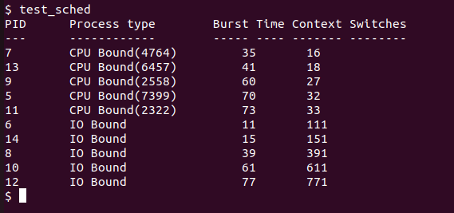
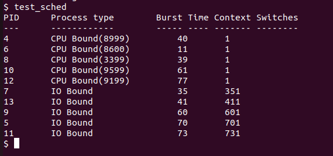
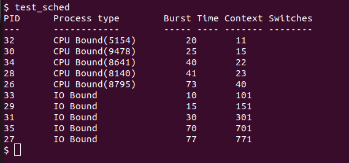

<h1 align="center">Process Management and Scheduling</h1>

##  :beginner: Overview
* This section is an attempt to understanding **Process Management** and **Scheduling** in **Xv6**.
* Current scheduler in Xv6 is an **unweighted round robin scheduler.**  
* In this section, I modified the scheduler to take into account user-defined process burst time and implemented:
    * **Shortest job first Scheduler**
    * **Hybrid Scheduler**
##  :round_pushpin: Some Prequisites
1) ### getNumProc function
* A system call that returns the total number of **active** processes in the system. This includes process in state :
     * **EMBRYO** (New process is being created)
     * **RUNNABLE** (Process is ready to run)
     * **RUNNING** (Process is executing)
     * **SLEEPING** (Blocked for an I/O)
     * **ZOMBIE** (Finished execution)
```C
int getNumProc(void)
{
  int active = 0;

  acquire(&ptable.lock);

  struct proc *process;

  for (process = ptable.proc; process < &ptable.proc[NPROC]; process++)
  {
    if (process->state != UNUSED)
    {
      active++;
    }
  }

  release(&ptable.lock);
  return active;
}
```
2) ### getMaxPid function
* A system call that returns the maximum **PID** amongst all the PIDs of the currently active processes in the system.
```C
int getMaxPid(void)
{
  int max_active = -1;

  acquire(&ptable.lock);

  struct proc *process;

  for (process = ptable.proc; process < &ptable.proc[NPROC]; process++)
  {
    if (process->state != UNUSED)
    {
      if (max_active < process->pid)
      {
        max_active = process->pid;
      }
    }
  }

  release(&ptable.lock);
  return max_active;
}
```
3) ### getProcInfo function
* A system call that returns 0 and assigns the **processInfo structure** accordingly on finding an entry about a process, else returns -1.
* Below is the definition of **structure processInfo**:
```C
struct processInfo
{
    int ppid;
    int psize;
    int numberContextSwitches;
};
```
* Include **numberContextSwitches** field in **struct proc**:
```C
int numberContextSwitches;   // Number of Context Switches
```
* Below is the definition of the system call
```C
int getProcInfo(int pid, struct processInfo * procInfo)
{
  struct proc *p;
  int idx = 0;
  acquire(&ptable.lock);
  for (p = ptable.proc; p < &ptable.proc[NPROC]; p++)
  {
    if (p->pid == pid)
    {
      procInfo->numberContextSwitches = p->numberContextSwitches;
      procInfo->ppid = p->parent->pid;
      procInfo->psize = p->sz;
      release(&ptable.lock);
      return 0;
    }
    idx++;
  }
  release(&ptable.lock);

  return -1;
}
```
4) ### Burst Time
* Include **burst_time** field in **struct proc**:
```C
int burst_time;              // Burst Time of Process
```
   * **set_burst_time** function call
   ```C
   int set_burst_time(int n)
   {
     struct proc *cur_proc = myproc();
     cur_proc->burst_time = n;
     return 0;
   }
   ```
   * **get_burst_time** function call
   ```C
   int get_burst_time(void)
   {
     struct proc *cur_proc = myproc();
     return cur_proc->burst_time;
   }
   ```
5) ### Finishing up
* To add all the above system calls, add them appropropriately in :
   * defs.h
   * syscall.h
   * syscall.c
   * sysproc.c
   * user.h
   * usys.S
* To test them, I made the following files and added them appropriately in Makefile :
   * test_getNumProc.c
   * test_getMaxPid.c
   * test_getProcInfo.c
   * test_set_burst_time.c
   * test_get_burst_time.c
##  :brain: Scheduling
* Xv6 uses **Unweighted Round Robin** as the default Scheduler.
* A process **yields** if it has executed for a specific period of time and switches to a the **scheduler**.
* Forces the process to give up CPU on one clock tick.
```C
// Round Robin Qauntum
if(myproc() && myproc()->state == RUNNING &&
  tf->trapno == T_IRQ0+IRQ_TIMER)
 yield();
```
### test_sched.c
To test the scheduler, I have created a **test_sched.c** file and included it in Makefile. In it, we simulate
a list of processes with different burst time values, assigned from a list of 15 values. We created 10 children processes, half of them were given a computationally intensive task (**CPU BOUND**) and other half were put to repeatedly put to sleep (**I/O BOUND**).
```C
#include "types.h"
#include "stat.h"
#include "user.h"

int main()
{
    int rand_val[15] = {30, 20, 10, 40, 70, 11, 35, 39, 60, 61, 73, 77, 41, 15, 25};
    int burst_val[10];
    int x = getpid() % 15;
    for (int i = 0; i < 10; i++)
    {
        burst_val[i] = rand_val[x];
        x = (x + 1) % 15;
    }
    printf(1, "PID\t Process type\t     Burst Time\tContext Switches\n");
    printf(1, "---\t ------------\t     ----- ----\t------- --------\n");
    for (int i = 0; i < 10; i++)
    {
        int pid = fork();
        if (pid == 0)
        {
            set_burst_time(burst_val[i]);
            if (i % 2 == 0)
            {
                double temp = 0;
                for (int j = 0; j < 500000 * burst_val[i]; j++)
                {
                    temp += 1.12 * 2.71;
                }
                int computed_val = ((int)temp) % 9000 + 1000;
                printf(1, "%d\t CPU Bound(%d) \t", getpid(), computed_val);
            }
            else
            {
                for (int j = 0; j < 10 * burst_val[i]; j++)
                {
                    sleep(1);
                }
                printf(1, "%d\t IO Bound    \t\t", getpid());
            }

            struct processInfo *procinfo = (struct processInfo *)malloc(sizeof(struct processInfo));
            getProcInfo(getpid(), procinfo);
            printf(1, " %d \t  %d\n", get_burst_time(), procinfo->numberContextSwitches);
            exit();
        }
    }

    while (wait() != -1)
        ;

    exit();
}
```
### Results.


##  :chart_with_upwards_trend: Shortest Job First Scheduling
* In this type of scheduling, we must we need to select the task with the shortest burst time and execute it first.
* To implement this, we must first disable the timer interrupt, which causes the kernel to preempt the process after a fixed period of time.
* Comment the following in **trap.c**
```C
// Round Robin Qauntum
// if(myproc() && myproc()->state == RUNNING &&
//    tf->trapno == T_IRQ0+IRQ_TIMER)
//   yield();
```
### void scheduler()
```C
void scheduler(void)
{
  struct proc *p;
  struct cpu *c = mycpu();
  c->proc = 0;

  for (;;)
  {
    sti();
    acquire(&ptable.lock);
    struct proc *sjf = 0;
    for (p = ptable.proc; p < &ptable.proc[NPROC]; p++)
    {
      if (p->state != RUNNABLE)
        continue;
      if (sjf == 0)
      {
        sjf = p;
      }
      else if (sjf->burst_time > p->burst_time)
      {
        sjf = p;
      }
    }
    p = sjf;
    if (p != 0)
    {
      c->proc = p;
      switchuvm(p);
      p->state = RUNNING;
      p->numberContextSwitches++;
      swtch(&(c->scheduler), p->context);
      switchkvm();
      c->proc = 0;
    }
    release(&ptable.lock);
  }
}
```
* We iterate through the process table every time and select the job with the shortest burst time.
*  **switchuvm(p)** basically switches the hardware page table to that of the new process.
*  We set the state of the process to **RUNNING** and context switch from scheduler thread to process.
*  Later when the process ends/ preempted by kernel, we context switch back to kernel scheduler thread by **switchkvm()**.
### Results.
* Testing on **test_sched.c**. <br>



* All CPU bound processes have 1 context switch as scheduling is non preemptive and cpu doesnt switch to another process until execution of current process has been completed.
* Context switches for I/O bound processes are more as they have been put to sleep many times. However their context swicthes amount are still in order of their burst times.
##  :chart_with_upwards_trend: Hybrid Scheduling
* A brief Overview of **Hybrid Scheduling** is given :
     * Create a ready queue RQ where the processes get submitted.
     * Set up the processes in RQ in the increasing order of burst -time of each process.
     * Fix the time slice as execution time of the first process lying in the Ready Queue RQ.
     * DO the ext 2 steps UNTIL ready queue RQ gets vacant.
     * Select the primary process in RQ and allocate CPU to it for unit time quantum.
     * The process in ready queue RQ is to be removed IF running process’ remaining burst time
         becomes zero. ELSE move the method which is executing to the termination of the Ready
         Queue RQ.
* To implement this, I added 2 fields in **struct proc**
```C
int time_quanta;             // Time quanta for Process
int cur_exec_total;          // Total Time for which the process was Running
```
* In **trap.c**, we have a timer interrupt when the the process' execution time is same as their time quanta.
```C
// Hybrid Quantum
if (myproc() && myproc()->state == RUNNING && tf->trapno == T_IRQ0 + IRQ_TIMER)
{
 myproc()->cur_exec_total++;
 if (myproc()->cur_exec_total >= myproc()->time_quanta)
 {
   yield();
 }
}
```
* **void Scheduler()**
```C
//HYBRID
void scheduler(void)
{
  struct cpu *c = mycpu();
  c->proc = 0;

  for (;;)
  {
    sti();
    acquire(&ptable.lock);
    struct proc *Ready_Queue[NPROC];
    for (int i = 0; i < NPROC; i++)
    {
      Ready_Queue[i] = 0;
    }

    int idx = 0;
    struct proc *p;
    for (p = ptable.proc; p < &ptable.proc[NPROC]; p++)
    {
      if (p->state == RUNNABLE)
      {
        Ready_Queue[idx++] = p;
      }
    }
    if (idx != 0)
    {
      struct proc *temp;
      for (int i = 0; i < idx; i++)
      {
        for (int j = i + 1; j < idx; j++)
        {
          if (Ready_Queue[i]->burst_time > Ready_Queue[j]->burst_time)
          {
            temp = Ready_Queue[i];
            Ready_Queue[i] = Ready_Queue[j];
            Ready_Queue[j] = temp;
          }
        }
      }
      int time_quanta = 1;
      for (int i = 0; i < idx; i++)
      {
        if (Ready_Queue[i]->burst_time > 0)
        {
          time_quanta = Ready_Queue[i]->burst_time;
          break;
        }
      }
      for (int i = 0; i < idx; i++)
      {
        p = Ready_Queue[i];
        p->time_quanta=time_quanta;
        if (p->state != RUNNABLE)
        {
          continue;
        }
        c->proc = p;
        switchuvm(p);
        p->state = RUNNING;
        p->numberContextSwitches++;
        swtch(&(c->scheduler), p->context);
        switchkvm();
        c->proc = 0;
      }
    }

    release(&ptable.lock);
  }
}
```
* We first create a queue of active processes in **Ready_Queue**.
```C
 for (p = ptable.proc; p < &ptable.proc[NPROC]; p++)
 {
   if (p->state == RUNNABLE)
   {
     Ready_Queue[idx++] = p;
   }
 }
```
* We then sort the **Ready_Queue** in order of increasing burst times.
```C
struct proc *temp;
for (int i = 0; i < idx; i++)
{
  for (int j = i + 1; j < idx; j++)
  {
    if (Ready_Queue[i]->burst_time > Ready_Queue[j]->burst_time)
    {
      temp = Ready_Queue[i];
      Ready_Queue[i] = Ready_Queue[j];
      Ready_Queue[j] = temp;
    }
  }
}
```
* We set default **time_quanta** for this batch to be 1. We then iterate through the queue and check for the process with least positive burst time and assign it to **time_quanta**.
```C
int time_quanta = 1;
for (int i = 0; i < idx; i++)
{
  if (Ready_Queue[i]->burst_time > 0)
  {
    time_quanta = Ready_Queue[i]->burst_time;
    break;
  }
}
```
* We then traverse through the Ready Queue and run each process for a time quanta.
```C
for (int i = 0; i < idx; i++)
{
  p = Ready_Queue[i];
  p->time_quanta=time_quanta;
  if (p->state != RUNNABLE)
  {
    continue;
  }
  c->proc = p;
  switchuvm(p);
  p->state = RUNNING;
  p->numberContextSwitches++;
  swtch(&(c->scheduler), p->context);
  switchkvm();
  c->proc = 0;
}
```
### Results.
* Testing on **test_sched.c** <br>



* Context switches for CPU bound processes are not 1 since they are preempted but are still in order of their burst times.
* Context switches for I/O bound processes are more as they have been put to sleep many times. However their context swicthes amount are still in order of their burst times.
