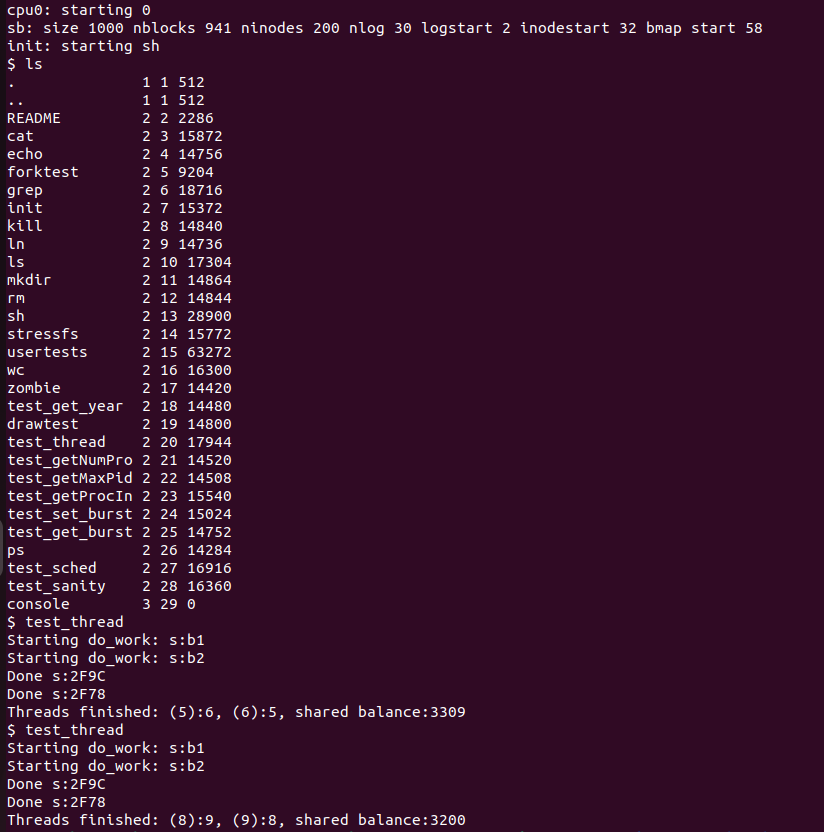
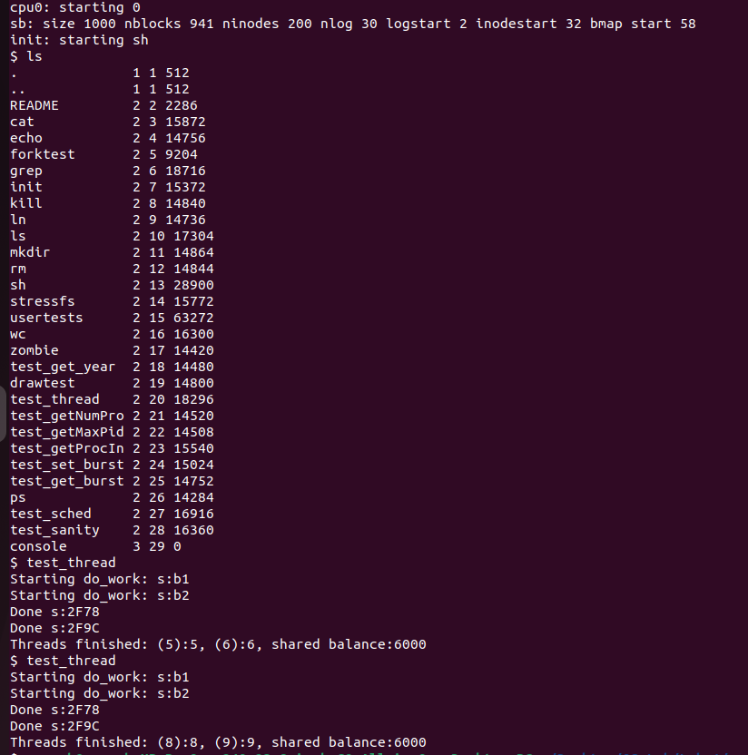

<h1 align="center">Thread and Synchronization</h1>

##  :beginner: Overview
* This section is an attempt to implement **Kernel level Threads** and **Spinlocks** for it's synchronization and correctness. <br>
* Threads are very similar to processes. They allow for parallel execution and share same address space. <br>
* Threads of a process have different stack, registers, program counters and state. <br>
* Locks are a common way to ensure that access(read/write) to shared data occurs appropriately and correctly. <br>

## :thread: Thread Implementation
To implement threads, I made use of the codes provided for **fork**, **wait**, **exit** and modified them to create threads, rather than processes.
1) ### thread_create function
```C
int thread_create(void(*fcn)(void*), void *arg, void*stack)
{
  int i, pid;
  struct proc *np;
  struct proc *curproc = myproc();

  // Allocate process.
  if((np = allocproc()) == 0){
    return -1;
  }

  // Page Table is same.
  np->pgdir = curproc->pgdir;   

  np->sz = curproc->sz;
  np->parent = curproc;
  *np->tf = *curproc->tf;

  // Clear %eax so that fork returns 0 in the child.
  np->tf->eax = 0;

  // Stack Size is of 1 page
  np->tf->esp = (uint)stack + 4096;

  // Load Arguments in Stack
  np->tf->esp -= 4;
  *((uint*)(np->tf->esp)) = (uint)arg;

  // Save Return Address in stack
  np->tf->esp -= 4;
  *((uint*)(np->tf->esp)) = 0xffffffff;

  // Set instruction Pointer
  np->tf->eip = (uint) fcn;

  for(i = 0; i < NOFILE; i++)
    if(curproc->ofile[i])
      np->ofile[i] = filedup(curproc->ofile[i]);
  np->cwd = idup(curproc->cwd);

  safestrcpy(np->name, curproc->name, sizeof(curproc->name));

  pid = np->pid;

  acquire(&ptable.lock);

  np->state = RUNNABLE;

  release(&ptable.lock);
```
* Trapframe refers to the state of registers saved on the kernel stack before entering into handling a trap/interrupt.
* First allocate an entry in the process table using **allocproc**.
```C
np->pgdir = curproc->pgdir;
Setting the Page Table of the new thread to be same as the process that calls it.
```
```C
np->tf->eax = 0;
Register eax is set to 0 so that it returns 0 in the thread.
```
```C
np->tf->esp = (uint)stack + 4096;
Set the stack size to be of 1 page size (4096).
```
```C
*((uint*)(np->tf->esp)) = (uint)arg;
Save the arguments onto the stack.
```
```C
*((uint*)(np->tf->esp)) = 0xffffffff;
Save a fake return address on the stack.
```
```C
np->tf->eip = (uint) fcn;
Set the instruction pointer to the function pointer passed, so that it starts executing from the start of the function.
```
* Copy all the file descriptors from the parent.
* Set the state to **RUNNABLE**.
2) ### thread_join function
```C
int thread_join(void)
{
  struct proc *p;
  int havekids, pid;
  struct proc *curproc = myproc();

  acquire(&ptable.lock);
  for (;;)
  {
    // Scan through table looking for exited children.
    havekids = 0;
    for (p = ptable.proc; p < &ptable.proc[NPROC]; p++)
    {
      if (p->parent != curproc)
        continue;
      havekids = 1;
      if (p->state == ZOMBIE)
      {
        // Found one.
        pid = p->pid;
        kfree(p->kstack);
        p->kstack = 0;
        // freevm(p->pgdir);    // Dont free the page directory
        p->pid = 0;
        p->parent = 0;
        p->name[0] = 0;
        p->killed = 0;
        p->state = UNUSED;
        release(&ptable.lock);
        return pid;
      }
    }

    // No point waiting if we don't have any children.
    if (!havekids || curproc->killed)
    {
      release(&ptable.lock);
      return -1;
    }

    // Wait for children to exit.  (See wakeup1 call in proc_exit.)
    sleep(curproc, &ptable.lock); // DOC: wait-sleep
  }
}
```
* We scan through the process table looking for any children of the current process.
* If no such children exist we **return -1**.
* If we find no children that have finished execution, we simply goto **sleep**.
* If there are children whose state is **ZOMBIE**, they have completed execution we clean it up and return it's **pid**.
```javascript
// freevm(p->pgdir);    // Dont free the page directory
```
* The only difference between the **wait** call and **thread_join** call is that we don't free the page directory when the thread completes as it is shared across all other threads and should not be deleted by children threads.
3) ### thread_exit function
```C
int thread_exit(void)
{
  struct proc *curproc = myproc();
  struct proc *p;
  int fd;

  if (curproc == initproc)
    panic("init exiting");

  // Close all open files.
  for (fd = 0; fd < NOFILE; fd++)
  {
    if (curproc->ofile[fd])
    {
      fileclose(curproc->ofile[fd]);
      curproc->ofile[fd] = 0;
    }
  }

  begin_op();
  iput(curproc->cwd);
  end_op();
  curproc->cwd = 0;

  acquire(&ptable.lock);

  // Parent might be sleeping in wait().
  wakeup1(curproc->parent);

  // Pass abandoned children to init.
  for (p = ptable.proc; p < &ptable.proc[NPROC]; p++)
  {
    if (p->parent == curproc)
    {
      p->parent = initproc;
      if (p->state == ZOMBIE)
        wakeup1(initproc);
    }
  }

  // Jump into the scheduler, never to return.
  curproc->state = ZOMBIE;
  sched();
  panic("zombie exit");
}
```
* We use the exact same code as **exit** call as the functionality is pretty much the same.
* We close all file descriptors and close the current working directory.
* We wakeup the parent, if it exists.
* We set the state of the process to **ZOMBIE**.
4) ### Adding the system call
* defs.h
```C
int             thread_create(void(*)(void*), void *, void*);
int             thread_join(void);
int             thread_exit(void);
```
* syscall.h
```C
#define SYS_thread_create 24
#define SYS_thread_join 25 
#define SYS_thread_exit 26
```
* syscall.c
```C
extern int sys_thread_create(void);
extern int sys_thread_join(void);
extern int sys_thread_exit(void);
```
```C
[SYS_thread_create] sys_thread_create,	 
[SYS_thread_join] sys_thread_join,	 
[SYS_thread_exit] sys_thread_exit,
```
* sysproc.c
```C
int sys_thread_create(void)
{
    void(*fcn)(void*); 
    void *arg;
    void *stack;
    argptr(0,(void *) &fcn, sizeof(void(*)(void*)));
    argptr(1,(void *) &arg, sizeof(void*));
    argptr(2,(void *) &stack, sizeof(void*));
    return thread_create(fcn,arg,stack);
}

int sys_thread_join(void)
{
    return thread_join();
}

int sys_thread_exit(void)
{
  return thread_exit();
}
```
* user.h
```C
int thread_create (void(*)(void*),void*,void*);
int thread_join(void);
int thread_exit(void);
```
* usys.S
```C
SYSCALL(thread_create)
SYSCALL(thread_join)
SYSCALL(thread_exit)
```
5) ### Testing
Added **test_thread.c** and corresponding call in Makefile to test our implementation
```C
#include "types.h"
#include "stat.h"
#include "user.h"
#include "x86.h"

struct balance
{
    char name[32];
    int amount;
};

volatile int total_balance = 0;
volatile unsigned int delay(unsigned int d)
{
    unsigned int i;
    for (i = 0; i < d; i++)
    {
        __asm volatile("nop" :::);
    }
    return i;
}
void do_work(void *arg)
{
    int i;
    int old;
    struct balance *b = (struct balance *)arg;
    printf(1, "Starting do_work: s:%s\n", b->name);
    for (i = 0; i < b->amount; i++)
    {
        old = total_balance;
        delay(100000);
        total_balance = old + 1;
    }
    printf(1, "Done s:%x\n", b->name);
    thread_exit();
    return;
}
int main(int argc, char *argv[])
{
    struct balance b1 = {"b1", 3200};
    struct balance b2 = {"b2", 2800};
    void *s1, *s2;
    int t1, t2, r1, r2;
    s1 = malloc(4096);
    s2 = malloc(4096);
    t1 = thread_create(do_work, (void *)&b1, s1);
    t2 = thread_create(do_work, (void *)&b2, s2);
    r1 = thread_join();
    r2 = thread_join();
    printf(1, "Threads finished: (%d):%d, (%d):%d, shared balance:%d\n",
           t1, r1, t2, r2, total_balance);
    exit();
}
```
6) ### Results


* The shared balance is incorrect and different every time due to lack of synchronization while updating the shared variable **total_balance**.
## :closed_lock_with_key: Synchronization
* We were not able to get the correct output for shared balance in the last balance as it might have happened that both the threads might have updated the shared variable **total_balance** simultaneously.
* To fix this, we make the update function atomic so that only a single thread can perform it at a time.
* **SpinLocks** allow only a single thread to access the critical section of the code.
* A single thread is granted the request while others are blocked and have to wait until it frees it, before other can acquire it. This helps in mutual exclusion.
### Implementing SpinLocks
```C
struct thread_spinlock
{
    uint lock;
};
```
* Value **0** indicates that the lock is free and can be acquired.
* Value **1** indicates that the lock is currently being used by some process/thread and the process that requires it must wait.
```C
void thread_spin_init(struct thread_spinlock *lk)
{
    lk->lock = 0;
}
```
* Initialise the lock to set it's value to 0, indicating it is free.
```C
void thread_spin_lock(struct thread_spinlock *lk)
{
    while (xchg(&lk->lock, 1) != 0)
        ;
    __sync_synchronize();
}
```
* We make use of the **xchg** function which atomically exchanges 2 values and returns the old value of lock.
* We set the value of lock to **1** everytime we call the xchg function and check if the old value was **0** or not, which indicates it was free.
* An old value of **1** indicates that the lock is currently in use and cannot be acquired.
* The __sync_synchronize() function in xv6 is a memory barrier. It tells the compiler and CPU to not reorder loads or stores across the barrier. This is important for ensuring that data is consistent between different threads or processes.
```C
void thread_spin_unlock(struct thread_spinlock *lk)
{
    __sync_synchronize();
    asm volatile("movl $0, %0" : "+m"(lk->lock) :);
}
```
* We atomically set the value of lock to be **0**, indicating it is free.
### Testing 
Modified **test_thread.c** to incorporate locking mechanism.
```C
#include "types.h"
#include "stat.h"
#include "user.h"
#include "x86.h"

struct balance
{
    char name[32];
    int amount;
};

struct thread_spinlock
{
    uint lock;
};
struct thread_spinlock *lk;
void thread_spin_init(struct thread_spinlock *lk)
{
    lk->lock = 0;
}

void thread_spin_lock(struct thread_spinlock *lk)
{
    while (xchg(&lk->lock, 1) != 0)
        ;
    __sync_synchronize();
}
void thread_spin_unlock(struct thread_spinlock *lk)
{
    __sync_synchronize();
    asm volatile("movl $0, %0" : "+m"(lk->lock) :);
}

volatile int total_balance = 0;
volatile unsigned int delay(unsigned int d)
{
    unsigned int i;
    for (i = 0; i < d; i++)
    {
        __asm volatile("nop" :::);
    }
    return i;
}
void do_work(void *arg)
{
    int i;
    int old;
    struct balance *b = (struct balance *)arg;
    printf(1, "Starting do_work: s:%s\n", b->name);
    for (i = 0; i < b->amount; i++)
    {
        // thread_spin_lock(lk);
        old = total_balance;
        delay(100000);
        total_balance = old + 1;
        // thread_spin_unlock(lk);
    }
    printf(1, "Done s:%x\n", b->name);
    thread_exit();
    return;
}
int main(int argc, char *argv[])
{
    thread_spin_init(lk);
    struct balance b1 = {"b1", 3200};
    struct balance b2 = {"b2", 2800};
    void *s1, *s2;
    int t1, t2, r1, r2;
    s1 = malloc(4096);
    s2 = malloc(4096);
    t1 = thread_create(do_work, (void *)&b1, s1);
    t2 = thread_create(do_work, (void *)&b2, s2);
    r1 = thread_join();
    r2 = thread_join();
    printf(1, "Threads finished: (%d):%d, (%d):%d, shared balance:%d\n",
           t1, r1, t2, r2, total_balance);
    exit();
}
```
### Results

* The shared balance is correct (3200+2800 = 6000) every time.
